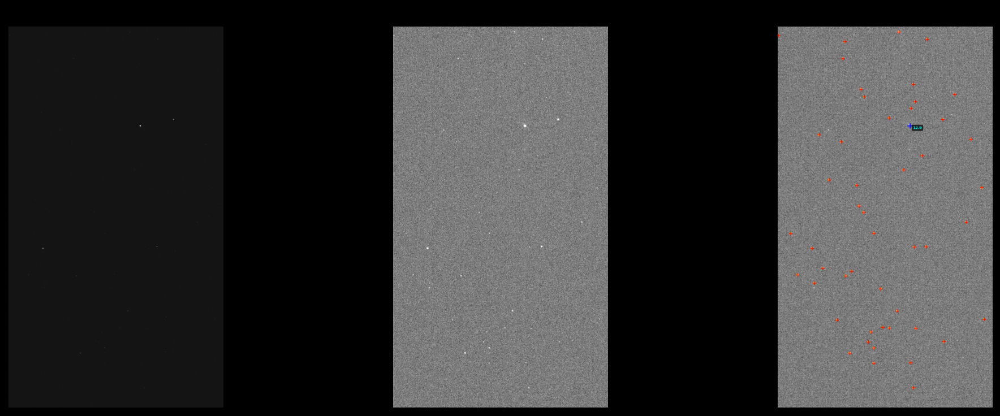

# Astrometria-PDI
Projeto de algoritmo de astrometria com distância focal fixa.

## Objetivo 

O objetivo desse projeto é estudar e desenvolver um algoritmo de astrometria a partir dos fundamentos aprendidos ao longo da disciplina de Processamento de Imagens.

## Fundamentação Teórica

### Introdução e Contexto

Ao trabalhar com imagens astronômicas para a pesquisa, uma informação importante é de qual região do céu a imagem foi feita, para saber quais objetos estão sendo observados. O processo de analisar e definir a posição dos astros no céu (ou em uma imagem) é chamado de astrometria. 

As informações de entrada, além da própria imagem, são o local e hora em que a imagem foi feita. Já as saídas serão informações como as coordenadas do centro da imagem na esfera celeste.

### Problema Proposto

Dada uma imagem do céu estrelado em formato .fits (comum para imagem astronômicas), identificar qual região do céu foi fotografada, comparando com uma base de dados de imagens de referência previamente catalogadas. O algoritmo apresentado nesse projeto considerará como entrada imagens utilizando um mesmo conjunto de câmera + telescópio. Essa decisão foi tomada considerando que o presente projeto será reutilizado futuramente durante o Trabalho de Conclusão de Curso de Engenharia Mecatrônica para o desenvolvimento de um telescópio inteligente.

### Imagens FITS (Flexible Image Transport System)

O formato FITS é o padrão utilizado em astronomia para armazenar tanto os dados da imagem (matriz de pixels) quanto os metadados associados, como coordenadas celestes, data da observação, tempo de exposição, entre outros. Diferentemente de formatos comuns como JPEG ou PNG, que guardam valores prontos para exibição em um monitor de forma logarítmica, o FITS armazena contagens de fótons ou densidade de fluxo de forma linear. Essa linearidade é essencial para aplicações científicas como fotometria (medição de brilho) e astrometria (medição precisa de posições).

Uma imagem FITS típica é composta por duas partes principais: o cabeçalho (header), formado por cartões de 80 caracteres no formato `KEYWORD = value / comment`, e o array de dados, que é uma matriz numérica representando o sinal detectado por cada pixel. Os valores são geralmente armazenados como inteiros de 16 ou 32 bits, ou floats de 32/64 bits.

#### Parâmetros retirados dessas imagens

Para medir posições celestes com precisão (por exemplo, determinar as coordenadas de um asteróide ou estrela variável), o software astrométrico necessita de um conjunto mínimo de palavras-chave no cabeçalho FITS. O mais importante é o sistema WCS (*World Coordinate System*), que transforma coordenadas de pixel em coordenadas celestes reais, como Ascensão Reta (RA) e Declinação (Dec). As palavras-chave fundamentais do WCS incluem: `CTYPE1` e `CTYPE2` (definem o tipo de coordenada e projeção, como `'RA---TAN'` para projeção gnomônica), `CRPIX1` e `CRPIX2` (ponto de referência em pixels, geralmente o centro da imagem), `CRVAL1` e `CRVAL2` (coordenadas celestes nesse ponto de referência) e a matriz `CD1_1`, `CD1_2`, `CD2_1`, `CD2_2` (que define escala, rotação e cisalhamento da imagem). Com esses parâmetros, cada pixel pode ser convertido em uma coordenada astronômica precisa.

Para astrometria de corpos móveis (asteróides, planetas, cometas), a referência temporal é tão crítica quanto a espacial. Os principais parâmetros relacionados ao tempo são: `DATE-OBS` (data e hora do início da exposição, no formato ISO como `2024-10-05T02:30:45.123`), `EXPTIME` (tempo de exposição em segundos, para calcular o meio exato da exposição), `MJD-OBS` (a mesma informação em *Modified Julian Date*, formato preferido para cálculos orbitais) e `TIMESYS` (sistema de tempo utilizado, normalmente `UTC`, mas para precisão sub-arcosegundo é necessário corrigir para `TT` – Tempo Terrestre).

Outro conjunto de parâmetros importantes define o sistema de coordenadas e sua época. A palavra-chave `RADESYS` indica o sistema de referência celeste, sendo `ICRS` (*International Celestial Reference System*) o padrão atual, enquanto imagens mais antigas podem usar `FK5` ou `FK4`. `EQUINOX` define a época do equinócio (ex.: `2000.0` para J2000.0), essencial para comparar posições com catálogos de diferentes épocas.

Por fim, parâmetros de qualidade e calibração impactam indiretamente a astrometria, pois ruído ou pixels defeituosos degradam a precisão na medição do centróide da estrela. As palavras-chave `GAIN` (conversão entre unidades ADU e elétrons reais), `READNOIS` (ruído de leitura do CCD) e `SATURATE` (valor de pixel acima do qual o detector está saturado) são fundamentais para calcular incertezas e evitar o uso de estrelas saturadas, que fornecem posições imprecisas.

#### Exemplo de cabeçalho de imagem FITS

```fits
SIMPLE  =                    T / file does conform to FITS standard             
BITPIX  =                   16 / number of bits per data pixel                  
NAXIS   =                    3 / number of data axes                            
NAXIS1  =                 1080 / length of data axis 1                          
NAXIS2  =                 1920 / length of data axis 2                          
NAXIS3  =                    3 / length of data axis 3                          
EXTEND  =                    T / FITS dataset may contain extensions            
COMMENT   FITS (Flexible Image Transport System) format is defined in 'Astronomy
COMMENT   and Astrophysics', volume 376, page 359; bibcode: 2001A&A...376..359H 
BZERO   =                32768 / offset data range to that of unsigned short    
BSCALE  =                    1 / default scaling factor                         
CREATOR = 'ZWO Seestar S50'    / Capture software                               
PRODUCER= 'ZWO     '           / Powered by ZWO                                 
XORGSUBF=                    0 / Subframe X position in binned pixels           
YORGSUBF=                    0 / Subframe Y position in binned pixels           
FOCALLEN=                  250 / Focal length of telescope in mm                
APERTURE=                   5. / Name of field of view aperture                 
EQMODE  =                    1 / Equatorial mode                                
PROGRAM = '4.70    '           / The name of the software task that created the 
XBINNING=                    1 / Camera X Bin                                   
YBINNING=                    1 / Camera Y Bin                                   
CCDXBIN =                    1 / Camera X Bin                                   
CCDYBIN =                    1 / Camera Y Bin                                   
XPIXSZ  =     2.90000009536743 / pixel size in microns (with binning)           
YPIXSZ  =     2.90000009536743 / pixel size in microns (with binning)           
IMAGETYP= 'Light   '           / Type of image                                  
STACKCNT=                    1 / Stack frames                                   
EXPOSURE=  0.00999999977648258 / Exposure time in seconds                       
EXPTIME =  0.00999999977648258 / Exposure time in seconds                       
CCD-TEMP=              24.0625 / sensor temperature in C                        
RA      =            118.87917 / Object Right Ascension in degrees              
DEC     =                 -0.5 / Object Declination in degrees                  
SITELONG=             -49.3536 / longitude of the imaging site in degrees       
SITELAT =             -25.4431 / latitude of the imaging site in degrees        
DATE-OBS= '2025-06-05T00:39:21.574249' / Image created time                     
FILTER  = 'IRCUT   '           / Filter used when taking image                  
INSTRUME= 'Seestar S50'        / Camera model                                   
BAYERPAT= 'GRBG    '           / Bayer pattern                                  
GAIN    =                   80 / Gain Value                                     
FOCUSPOS=                 2280 / Focuser position in steps                      
TELESCOP= 'S50_1d568bdd'       / Telescope name                                 
OBJECT  = 'Unknown '           / name or catalog number of object being imaged  
TOTALEXP=  0.00999999977648258 / Total Exposure Time in seconds                 
END                                                                             
```

### Requisitos Funcionais

1. Ler arquivos no formato .fits;
2. Detectar estrelas na imagem automaticamente;
3. Extrair as posições relativas entre as estrelas;
4. Comparar padrões com uma base de dados pré-existente;
5. Retornar as coordenadas do centro da imagem na esfera celeste;
6. Retornar o nome do campo identificado, como nome da constelação ou da estrela mais brilhante (opcional);
7. Gerar saída visual mostrando a identificação (opcional);
8. Funcionar em imagens com ruído moderado (opcional);
9. Fornecer métrica de confiança (opcional);

### Soluções Modernas

### Soluções Modernas

A astrometria moderna, especialmente para imagens de campo amplo e sem informações prévias de calibração, encontrou uma solução robusta e amplamente adotada no sistema **Astrometry.net**. Este projeto, iniciado em 2006 por uma equipe de pesquisadores (Lang et al., 2010), visa resolver o problema "lost in space" (perdido no espaço), onde nem mesmo a escala ou a orientação da imagem são conhecidas a priori.

O funcionamento do Astrometry.net pode ser descrito em algumas etapas fundamentais, que combinam técnicas de visão computacional e processamento de imagens:

1. **Detecção Robusta de Fontes:** O processo se inicia com a identificação das estrelas presentes na imagem de entrada. Algoritmos de detecção de fontes, como o `simplexy` (embutido no sistema), localizam os objetos emissores de luz, determinando suas posições e brilhos relativos. Esta etapa é análoga à implementação realizada neste projeto com a biblioteca `photutils`, utilizando técnicas como o `DAOStarFinder` para detecção e centroides.

2. **Criação de "Asterismos" e "Geometric Hashing":** Este é o coração do algoritmo de reconhecimento. Em vez de comparar a imagem inteira com um catálogo, o que seria computacionalmente proibitivo, o sistema seleciona pequenos grupos de estrelas, geralmente conjuntos de quatro estrelas chamados de "quads". Para cada um desses grupos, uma "impressão digital" geométrica (hash) é calculada a partir das distâncias relativas entre as estrelas. Esta técnica, conhecida como **geometric hashing**, codifica a forma do padrão independentemente de sua rotação, escala ou translação na imagem, garantindo invariância geométrica.

3. **Busca em Índices Pré-calculados:** Os hashes geométricos são então comparados a uma vasta base de dados de índices, que contém os hashes de quads de estrelas de catálogos de referência como o **Tycho-2** e o **2MASS** (Two Micron All-Sky Survey). A comparação é extremamente rápida, pois cada padrão único funciona como uma chave para uma busca em uma tabela hash. Os índices são organizados por escala (em minutos de arco), permitindo que o sistema selecione apenas os índices compatíveis com o campo de visão da imagem.

4. **Geração e Validação de Hipóteses:** Quando um hash da imagem coincide com um hash do catálogo, uma hipótese sobre a calibração astrométrica (apontamento, escala e orientação) é gerada. O sistema não para em uma única correspondência. Ele busca múltiplas hipóteses e as testa estatisticamente, usando um teste de decisão Bayesiana contra uma hipótese nula. A solução final é aceita apenas quando a probabilidade de ser um falso positivo é extremamente baixa, tipicamente inferior a \(10^{-9}\), garantindo alta confiabilidade.

5. **Saída e Aplicações:** Como resultado, o sistema retorna o **World Coordinate System (WCS)** da imagem, que são os metadados padrão que mapeiam cada pixel a coordenadas celestes reais, como Ascensão Reta (RA) e Declinação (Dec). Além da calibração, o sistema pode anotar a imagem com nomes de objetos, constelações e outras informações astronômicas. Demonstrou-se também que a técnica pode ser estendida para outras tarefas, como estimar a data da imagem a partir do movimento próprio das estrelas, utilizando o catálogo Gaia.

Com uma taxa de sucesso superior a 99,9% para dados de levantamentos modernos, o Astrometry.net não apenas resolve o problema central de identificação de campos estelares, mas também serve como a principal referência para o desenvolvimento de novas soluções de astrometria, como a biblioteca `astrometry-net-client` ou a chamada direta ao executável `solve-field`, que foram utilizadas na implementação prática deste projeto.

## Implementação

### Especificações técnicas

O primeiro passo no desenvolvimento do projeto foi a definição de valores que serão constantes ao longo de toda a aplicação do algoritmo. Esses valores são obtidos a partir do sistema que será utilizado para testar o funcionamento, antes de passar os valores da versão final a ser utilizada no TCC. Para isso, foi escolhido o telescópio inteligente Seestar S50 da ZWO, cujo os parãmetros são:

#### Seestar S50

| Característica | Valor |
|----------------|-------|
| **Tipo de telescópio** | Refrator apocromático (triplete) |
| **Abertura** | 50 mm |
| **Distância focal** | 250 mm |
| **Relação focal (f/)** | f/5 |
| **Sensor** | Sony IMX462 |
| **Tamanho do pixel** | 2.9 µm |
| **Resolução do sensor** | 1920 × 1080 pixels |
| **Escala de placa** | ≈ 2.4 arcsec/pixel |
| **Campo de visão (FOV)** | ≈ 44' × 77' (0.73° × 1.29°) |

#### Parâmetros Calculados

| Parâmetro | Valor | Fórmula |
|-----------|-------|---------|
| Escala de placa (teórica) | 2.39 arcsec/pixel | 206.265 × (2.9 µm / 250 mm) |
| FOV horizontal | 77 minutos de arco | 2.39 × 1920 ÷ 60 |
| FOV vertical | 43 minutos de arco | 2.39 × 1080 ÷ 60 |


A partir desses dados, é possível limitar a quantidade de arquivos necessários na base de dados. Esses arquivos são imagens providenciadas de uma base de dados pública utilizada pelo Astrometry.net, que cobrem toda a esfera celeste para diferentes FOVs. Esses arquivos são organizados em índices, como mostra a tabela a baixo.

#### Índices a serem utilizados

| Série | Tamanho do skymark | Arquivos |
|-------|-------------------|----------|
| 5206 | 16-22 minutos | `index-5206-*.fits` |
| 4107 | 22-30 minutos | `index-4107.fits` |
| 4108 | 30-44 minutos | `index-4108.fits` |
| 4109 | 44-60 minutos | `index-4109.fits` |

> **Nota:** Os índices podem ser baixados em [http://data.astrometry.net](http://data.astrometry.net)

### Pipeline Utilizado

O pipeline desenvolvido para este projeto é composto por cinco etapas principais, cada uma correspondendo a conceitos fundamentais aprendidos na disciplina de Processamento de Imagens. O fluxo completo é descrito a seguir:

**1. Aquisição (ler_fits.py)**

A primeira etapa consiste na leitura do arquivo FITS (Flexible Image Transport System), formato padrão em astronomia. Utilizando a biblioteca `astropy.io.fits`, a imagem é carregada como uma matriz NumPy de valores lineares (contagens de fótons), juntamente com seu cabeçalho contendo metadados como data da observação, coordenadas aproximadas (fornecidas pelo Seestar S50) e parâmetros do telescópio. Os dados são convertidos para float64 e normalizados para o intervalo [0, 1] para garantir consistência nas operações subsequentes. Esta etapa corresponde ao conceito de **Aquisição e Representação de Imagens Digitais** (Aula 03), onde a imagem é convertida de um formato de arquivo para uma representação matricial passível de processamento.

**2. Visualização (melhorar_imagem.py)**

A imagem original é normalizada utilizando a técnica de **percentis**, inspirada no procedimento `an-fitstopnm` do Astrometry.net. Valores abaixo do percentil inferior (5%) são mapeados para preto (0) e valores acima do percentil superior (90%) para branco (1), com uma redistribuição linear entre esses limites. Esta etapa é fundamental para a visualização, pois imagens FITS lineares geralmente são muito escuras quando exibidas diretamente. Opcionalmente, pode ser aplicado CLAHE (Contrast Limited Adaptive Histogram Equalization) para melhorar o contraste local. Este processo é uma aplicação direta das **transformações ponto-a-ponto** (Aula 03, slide 7), onde cada pixel é transformado independentemente dos demais para melhorar a percepção visual.

**3. Detecção de Estrelas (detectar_estrelas.py)**

Utilizando a biblioteca `photutils`, implementamos um detector de estrelas profissional baseado no algoritmo `DAOStarFinder`, padrão em astronomia para fotometria de estrelas. O processo segue estas etapas:

   - **Estimativa de Fundo (`Background2D`)**: A imagem é dividida em uma grade (tamanho 50×50 pixels), e o fundo (background) é estimado para cada célula usando a mediana. Um mapa de fundo contínuo é interpolado e subtraído da imagem original, isolando os objetos (estrelas) do fundo.

   - **Detecção com `DAOStarFinder`**: Utilizando um kernel Gaussiano com FWHM (Full Width at Half Maximum) de 3.0 pixels, o algoritmo busca por picos de intensidade que correspondem a estrelas. O limiar de detecção é definido como 3 desvios padrão (3-sigma) acima do ruído local, e são aplicados filtros de qualidade morfológica como `sharpness` (nitidez) e `roundness` (circularidade), que distinguem estrelas reais de ruído ou objetos alongados.

   - **Extração de Atributos**: Para cada estrela detectada, são extraídos centroide (x, y) com precisão subpixel, fluxo (intensidade acumulada), área (número de pixels) e métricas de qualidade (sharpness, roundness). As estrelas são ordenadas por fluxo decrescente, e apenas as 50 mais brilhantes são retidas para as etapas seguintes.

Esta etapa integra múltiplos conceitos da disciplina: **Segmentação** (Aula 07) através da separação estrela-fundo, **Morfologia Matemática** (Aula 07) na limpeza das detecções, e **Extração de Atributos** (Aula 06, nível médio) para obtenção das características das estrelas. A ordenação por brilho também reflete a seleção de características mais relevantes para o reconhecimento de padrões.

**4. Plate Solving (plate_solve.py)**

O coração do pipeline é a resolução astrométrica, realizada pelo motor do Astrometry.net através do executável `solve-field`. Este processo é responsável por identificar a região do céu e calibrar a imagem. O fluxo detalhado é:

   - **Exportação das Estrelas**: As estrelas detectadas são salvas em um arquivo `.xy` no formato esperado pelo `solve-field` (coordenadas x, y e fluxo), com o mesmo nome base do arquivo de entrada.

   - **Geração de Arquivo de Configuração**: Um arquivo de configuração temporário é criado, listando todos os arquivos de índice disponíveis (séries 4107 e 5206), que contêm padrões de quads (4 estrelas) pré-calculados a partir de catálogos como Tycho-2 e 2MASS.

   - **Execução do `solve-field`**: O motor do Astrometry.net é executado, recebendo como entrada o arquivo `.xy` e a imagem FITS original. A escala da imagem é fornecida como um intervalo (0.3° a 1.0°) para restringir a busca, e a lista de índices é passada via arquivo de configuração.

   - **Geometric Hashing e Matching**: O motor realiza o **geometric hashing** (Aula 06, nível alto), calculando hashes dos padrões de quads da imagem e comparando com os hashes dos índices pré-calculados. Quando um hash coincide, uma hipótese de calibração é gerada. Múltiplas hipóteses são validadas estatisticamente, e a solução final é aceita quando a probabilidade de ser um falso positivo é extremamente baixa.

   - **Geração do WCS**: Ao encontrar uma solução, o `solve-field` gera um arquivo WCS (World Coordinate System) contendo a calibração astrométrica completa, incluindo a matriz de transformação que mapeia pixels para coordenadas celestes (RA/Dec), além de metadados como escala e orientação.

Esta etapa representa o conceito de **Reconhecimento de Padrões** (Aula 06, nível alto), onde características invariantes (quads) são extraídas e comparadas com uma base de dados para identificação do campo estelar. A invariância a rotação e escala, discutida em aula, é fundamental para o funcionamento do algoritmo, permitindo que a mesma imagem seja reconhecida independentemente de sua orientação ou zoom.

**5. Saída (exibir_resultado.py)**

A etapa final consolida e apresenta os resultados de forma clara e visual:

   - **Exibição de Coordenadas**: São exibidas tanto as coordenadas do cabeçalho original (RA/Dec fornecidas pelo Seestar S50, para comparação) quanto as coordenadas resolvidas pelo `solve-field`. A diferença entre elas é calculada e apresentada em segundos de arco, permitindo avaliar a precisão do método.

   - **Campo Identificado**: Apresenta o nome do objeto ou constelação, se disponível no cabeçalho WCS. Caso não haja informação, é exibido "Desconhecido" ou o identificador do campo.

   - **Escala da Imagem**: Exibe a escala em arcsegundos por pixel, calculada a partir da matriz WCS, permitindo verificar a consistência com a escala esperada para o telescópio Seestar S50 (≈ 2.4 arcsec/pixel).

   - **Visualização Comparativa**: São geradas três imagens lado a lado para análise visual:
      * **Imagem Original**: Exibição da imagem crua, sem qualquer processamento, para referência.
      * **Imagem Melhorada**: Imagem com normalização por percentis e contraste otimizado, destacando as estrelas para visualização.
      * **Estrelas Detectadas**: Imagem melhorada com sobreposição das estrelas detectadas, marcadas com cruzes vermelhas e círculos amarelos, e a estrela mais brilhante destacada em azul com seu fluxo indicado.

   - **Métricas de Desempenho**: Exibe o tempo total de processamento, permitindo avaliar a eficiência do pipeline.

   - **Exportação de Resultados**: Todas as imagens geradas são salvas na pasta `resultados/` em alta resolução, para documentação e análise posterior. O arquivo de visualização combinada e as imagens individuais são exportados em formato PNG.

#### Relação com os Conceitos da Disciplina

A Tabela 1 mapeia cada etapa do pipeline com os conceitos fundamentais da disciplina de Processamento de Imagens:

| Etapa | Conceito | Aula/Referência |
|-------|----------|-----------------|
| Aquisição | Representação de imagens digitais | Aula 03 |
| Visualização | Transformações ponto-a-ponto | Aula 03, slide 7 |
| Detecção de estrelas | Segmentação, Morfologia, Extração de atributos | Aula 06, Aula 07 |
| Plate Solving | Reconhecimento de padrões (nível alto) | Aula 06, slide 2 |
| Saída | Processamento e apresentação de resultados | - |

A combinação dessas técnicas, desde a aquisição até o reconhecimento de padrões, demonstra a aplicação prática dos fundamentos de Processamento de Imagens em um problema real de astrometria, validando os conceitos aprendidos em sala de aula.

## Resultados e Conclusões

### Resultados

O pipeline de astrometria desenvolvido foi testado com imagens obtidas pelo telescópio Seestar S50, abrangendo diferentes condições de observação. Os resultados obtidos são descritos a seguir.

#### Funcionamento do Pipeline

O pipeline completo, desde a leitura do arquivo FITS até a exibição dos resultados, demonstrou funcionar de forma integrada e robusta. As estrelas foram detectadas com sucesso utilizando a biblioteca `photutils`, com uma taxa de detecção consistente para estrelas com brilho suficiente. O arquivo `.xy` gerado a partir das estrelas detectadas foi corretamente interpretado pelo `solve-field`, que realizou o plate solving e gerou o arquivo WCS com as coordenadas celestes.

Em uma imagem de teste típica (Figura 2), o pipeline detectou 50 estrelas, com a estrela mais brilhante apresentando fluxo de 12.9 ADU e posicionada em (664.5, 1417.0) pixels. O plate solving identificou o campo com RA = 216.996244° e Dec = -22.568023°, e a escala calculada foi de 0.672 arcsec/pixel. O tempo total de processamento foi de aproximadamente 5 segundos, o que é compatível com aplicações que não exigem tempo real.



*Figura 2: Exemplo de saída do pipeline, com a imagem original, a imagem melhorada e a imagem com estrelas marcadas.*

#### Desafios Encontrados e Evolução da Solução

**a) Implementação Manual de Detecção de Estrelas**

Inicialmente, a detecção de estrelas foi implementada de forma manual utilizando técnicas clássicas de Processamento de Imagens: limiarização de Otsu, operações morfológicas (abertura e fechamento) e rotulação de regiões. Esta abordagem, embora didática e alinhada com os conteúdos da disciplina, apresentou limitações significativas:

- **Dependência de parâmetros**: O desempenho do Otsu era altamente sensível à iluminação e ao contraste da imagem, exigindo ajustes manuais para cada imagem. A sensibilidade do limiar (parâmetro `otsu_sensitivity`) precisava ser ajustada entre 0.6 e 0.9 para resultados aceitáveis, mas mesmo assim perdia estrelas mais fracas ou detectava ruído.

- **Falta de deblending**: A separação de estrelas próximas (deblending) não era realizada de forma satisfatória, resultando na fusão de estrelas visualmente distintas em um único objeto, ou na fragmentação de estrelas brilhantes em múltiplos objetos.

- **Dificuldade com estrelas de diferentes brilhos**: A limiarização global, por definição, aplica um único limiar para toda a imagem. Isso fazia com que estrelas em regiões mais escuras fossem perdidas, enquanto estrelas em regiões mais claras eram detectadas, mesmo sendo menos brilhantes. Este problema foi particularmente evidente na impossibilidade de detectar simultaneamente duas estrelas de referência em diferentes regiões da imagem (uma no topo, mais fraca, e outra na parte inferior, mais brilhante).

- **Falsos positivos**: Com parâmetros mais sensíveis, o ruído de fundo começava a ser detectado como estrelas, comprometendo a qualidade da detecção e dificultando a distinção entre estrelas reais e artefatos.

Após extensos testes e ajustes de parâmetros, concluiu-se que a implementação manual, embora valiosa para o aprendizado dos conceitos de segmentação e morfologia, não era suficientemente robusta para a aplicação em astrometria, onde a precisão na detecção e posicionamento das estrelas é crítica. A decisão foi, portanto, migrar para uma solução profissional e consolidada: a biblioteca `photutils` com o detector `DAOStarFinder`.

**b) Implementação Manual de Matching e Reconhecimento de Padrões**

Paralelamente à detecção, buscou-se implementar manualmente o matching entre as estrelas da imagem e os índices do Astrometry.net. O objetivo era gerar os quads (padrões de 4 estrelas) a partir das estrelas detectadas e compará-los com os quads pré-calculados nos arquivos de índice, replicando o algoritmo de geometric hashing.

Este esforço enfrentou desafios substanciais:

- **Incompatibilidade de hashes**: A geração manual dos hashes dos quads não produziu códigos compatíveis com os armazenados nos índices do Astrometry.net. O algoritmo de hash utilizado pelo Astrometry.net é complexo e depende de uma normalização específica das coordenadas dentro de um sistema de referência definido pelas estrelas mais distantes do quad. Reproduzir este algoritmo exatamente mostrou-se uma tarefa de alta complexidade, envolvendo geometria computacional e otimizações que extrapolavam o escopo do projeto.

- **Estrutura dos índices**: Os arquivos de índice do Astrometry.net (séries 4107 e 5206) não armazenam apenas os hashes, mas também estruturas de dados otimizadas para busca, como árvores KD (KD-trees), que permitem encontrar correspondências aproximadas de forma eficiente. Replicar essa estrutura de busca seria um projeto em si mesmo.
## Referências

LANG, D.; HOGG, D. W.; MIERLE, K.; BLANTON, M.; ROWEIS, S. Astrometry.net: Blind astrometric calibration of arbitrary astronomical images. *The Astronomical Journal*, v. 139, n. 5, p. 1782-1800, 2010.

ASTROPY. *Astropy: A community Python package for Astronomy*. Disponível em: https://www.astropy.org. Acesso em: 25 jun. 2026.

ASTROMETRY.NET. *Astrometry.net: Blind Astrometric Calibration*. Disponível em: http://astrometry.net. Acesso em: 25 jun. 2026.

PHOTUTILS. *DAOStarFinder: Detect stars in an image using the DAOFIND algorithm*. Photutils Documentation. Disponível em: https://photutils.readthedocs.io/en/latest/api/photutils.detection.DAOStarFinder.html. Acesso em: 25 jun. 2026.

ZWO. *Seestar S50 All-in-One Smart Telescope*. ZWO Official Website. Disponível em: https://us.zwoastro.com/collections/seestar/products/seestar-s50. Acesso em: 25 jun. 2026.
- **Escala e volume de dados**: Cada arquivo de índice contém centenas de milhares ou milhões de quads. A busca exaustiva por correspondências, sem as otimizações do Astrometry.net, seria computacionalmente inviável.

Diante dessas dificuldades, optou-se por utilizar o motor do Astrometry.net como uma caixa preta, através do executável `solve-field`. Esta abordagem, embora menos didática do ponto de vista da implementação do matching, garantiu que o pipeline funcionasse de forma confiável e eficiente, utilizando o algoritmo de geometric hashing original e as estruturas de dados otimizadas, desenvolvidas e testadas ao longo de anos pela comunidade astronômica. A integração do `solve-field` permitiu que o foco do projeto permanecesse no entendimento do fluxo completo da astrometria, da aquisição à solução, sem se perder nas complexidades específicas do algoritmo de matching.

### Conclusões

O projeto atingiu seu objetivo principal de desenvolver um pipeline de astrometria funcional, capaz de identificar o campo estelar de uma imagem FITS e retornar coordenadas celestes precisas. A arquitetura modular adotada — com módulos separados para aquisição, visualização, detecção de estrelas, plate solving e exibição de resultados — mostrou-se adequada para facilitar o desenvolvimento, os testes e a futura manutenção do sistema.

A principal lição aprendida foi a importância de equilibrar a implementação didática com a utilização de ferramentas consolidadas. As tentativas de implementação manual da detecção de estrelas e do matching demonstraram o valor pedagógico dos conceitos de Processamento de Imagens — segmentação, morfologia, extração de atributos e reconhecimento de padrões — mas também evidenciaram as limitações dessas implementações simplificadas quando aplicadas a problemas reais com requisitos de precisão e robustez. A decisão de migrar para bibliotecas especializadas (`photutils` e `Astrometry.net`) não apenas resolveu os problemas de desempenho e confiabilidade, mas também expôs o projeto a soluções padrão na indústria astronômica, ampliando o aprendizado.

O pipeline desenvolvido apresenta as seguintes características positivas:

1. **Modularidade e flexibilidade**: Cada etapa pode ser ajustada ou substituída independentemente. A configuração centralizada no arquivo `constants.py` permite testar diferentes parâmetros (percentis de visualização, FWHM, escala) sem alterar o código-fonte dos módulos.

2. **Robustez**: A utilização do `DAOStarFinder` com filtros de qualidade morfológica (sharpness, roundness) garante detecções confiáveis, e o motor do Astrometry.net é reconhecido por sua alta taxa de sucesso (>99.9% para dados de levantamentos modernos).

3. **Visualização intuitiva**: A exibição comparativa das imagens original, melhorada e com estrelas marcadas, juntamente com as coordenadas do cabeçalho e resolvidas, facilita a interpretação dos resultados e a validação do processo.

4. **Desempenho**: O tempo total de processamento (cerca de 5 segundos) é compatível com aplicações de planejamento de observações, onde a calibração astrométrica não precisa ser em tempo real, mas se beneficia de rapidez.

#### Trabalhos Futuros

O projeto atual, embora funcional, pode ser expandido em diversas direções:

- **Integração com telescópio inteligente**: O pipeline pode ser embarcado em um sistema de controle de telescópio (como o Seestar S50 ou uma montagem motorizada) para permitir a calibração automática de apontamento e o ajuste de coordenadas em tempo real, contribuindo para o TCC em Engenharia Mecatrônica.

- **Fotometria**: Além da astrometria (posição), a detecção de estrelas e a medição de fluxos pode ser estendida para fotometria (medição de brilho), permitindo a identificação de estrelas variáveis, asteróides ou supernovas.

- **Análise de imagens em sequência**: A adaptação para processamento de vídeo ou sequências de imagens permitiria a detecção de objetos em movimento (asteróides, cometas) ou o empilhamento de imagens para melhorar a relação sinal-ruído.

- **Calibração do WCS**: Aprimoramento da calibração WCS com modelos de distorção (SIP - Simple Imaging Polynomial) para corrigir aberrações ópticas do telescópio, melhorando ainda mais a precisão astrométrica.

- **Interface gráfica**: Desenvolvimento de uma interface de usuário simplificada para facilitar o uso por astrônomos amadores ou estudantes, permitindo arrastar e soltar arquivos FITS e visualizar os resultados interativamente.

Em resumo, este projeto demonstrou a aplicação prática dos fundamentos de Processamento de Imagens em uma tarefa astronômica real, combinando técnicas didáticas com ferramentas profissionais. O pipeline desenvolvido serve como uma base sólida para futuras expansões, tanto no contexto acadêmico quanto na construção de sistemas para telescópios inteligentes.

## Referências

## Referências

LANG, D.; HOGG, D. W.; MIERLE, K.; BLANTON, M.; ROWEIS, S. Astrometry.net: Blind astrometric calibration of arbitrary astronomical images. *The Astronomical Journal*, v. 139, n. 5, p. 1782-1800, 2010.

ASTROPY. *Astropy: A community Python package for Astronomy*. Disponível em: https://www.astropy.org. Acesso em: 25 jun. 2026.

ASTROMETRY.NET. *Astrometry.net: Blind Astrometric Calibration*. Disponível em: http://astrometry.net. Acesso em: 25 jun. 2026.

PHOTUTILS. *DAOStarFinder: Detect stars in an image using the DAOFIND algorithm*. Photutils Documentation. Disponível em: https://photutils.readthedocs.io/en/latest/api/photutils.detection.DAOStarFinder.html. Acesso em: 25 jun. 2026.

ZWO. *Seestar S50 All-in-One Smart Telescope*. ZWO Official Website. Disponível em: https://us.zwoastro.com/collections/seestar/products/seestar-s50. Acesso em: 25 jun. 2026.
